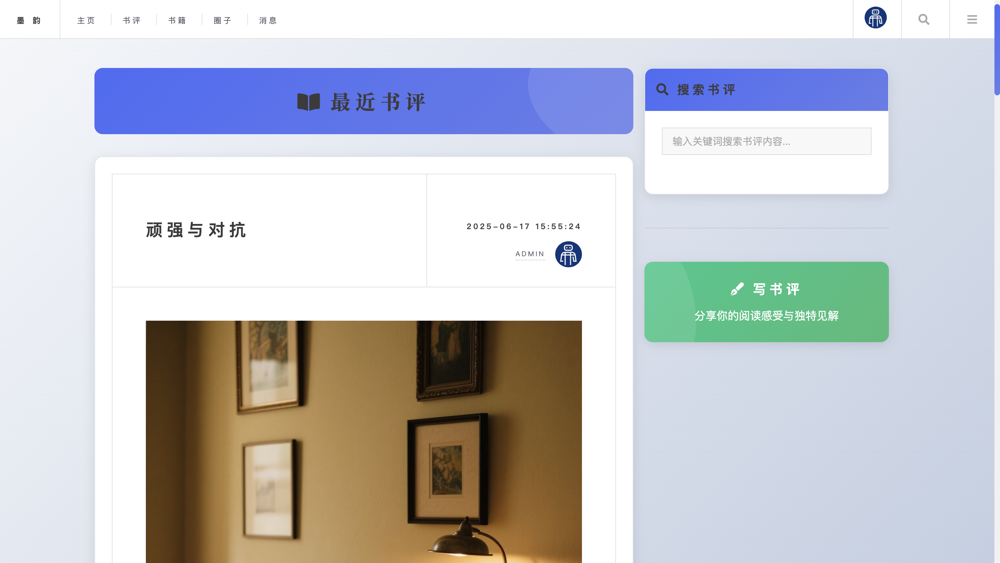
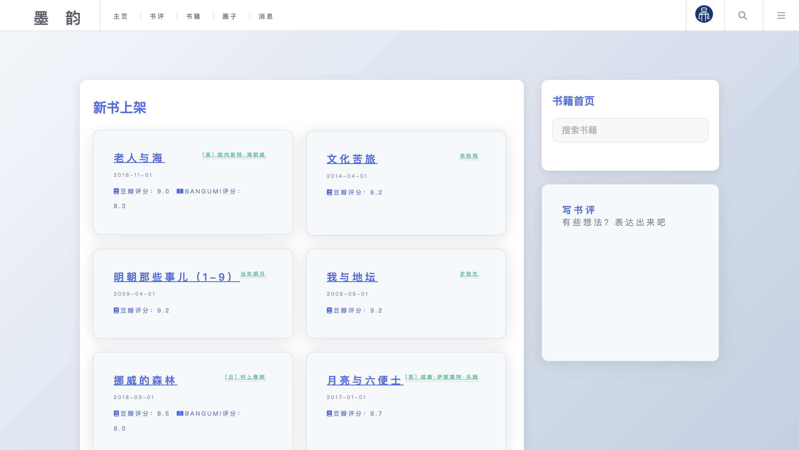
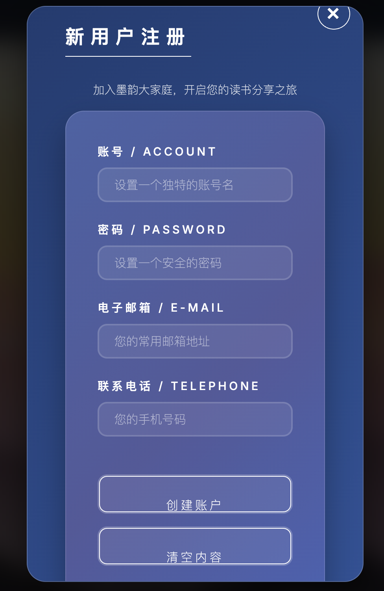

# 墨韵 (MoYun)


> 📖 “墨韵”是一个现代化的在线读书交流平台，致力于为所有热爱阅读的人打造一个分享感悟、发现好书、连接同好的优质社区。

---

## ✨ 项目简介

**墨韵 (MoYun)** 旨在解决书友们“好书无人分享，观点无处碰撞”的痛点。我们相信，每一次阅读都值得被记录，每一种思想都应该有回响。在这里，您可以：

-   **记录灵感**: 为您读过的每一本书撰写深刻的书评。
-   **发现宝藏**: 浏览他人的书评，发现下一本您心仪的好书。
-   **结交同好**: 创建或加入兴趣圈子，与志同道合的人一起探讨。
-   **自由交流**: 通过私信系统与朋友们畅所欲言。

我们追求技术与人文的结合，用简洁优雅的设计和流畅的交互体验，让分享阅读成为一种享受。

<details>
<summary>📸 效果展示 (点击展开/折叠)</summary>

<table>
  <tr>
    <td align="center">
      
      <br/>
      <sub><b>系统主界面</b></sub>
    </td>
    <td align="center">
      
      <br/>
      <sub><b>书评界面</b></sub>
    </td>
  </tr>
  <tr>
    <td align="center">
      
      <br/>
      <sub><b>书籍界面</b></sub>
    </td>
    <td align="center">
      
      <br/>
      <sub><b>圈子界面</b></sub>
    </td>
  </tr>
  <tr>
    <td align="center">
      
      <br/>
      <sub><b>消息界面</b></sub>
    </td>
    <td align="center">
      
      <br/>
      <sub><b>个人信息界面</b></sub>
    </td>
  </tr>
    <tr>
    <td align="center">
      
      <br/>
      <sub><b>登录界面</b></sub>
    </td>
    <td align="center">
      
      <br/>
      <sub><b>注册界面</b></sub>
    </td>
  </tr>
</table>

</details>

## 🚀 主要功能

-   **👤 用户系统**
    -   安全的注册与登录机制。
    -   可定制的个人主页，展示您的阅读轨迹和个人简介。
    -   轻松编辑个人资料和更换头像。

-   **📚 内容系统**
    -   **书籍库**: 详尽的书籍信息展示，包括封面、简介、作者等。
    -   **书评**: 支持 Markdown 语法的富文本编辑器，让您的书评图文并茂。
    -   **互动**: 为喜欢的书评点赞，或在评论区发表您的看法。

-   **🌐 社交系统**
    -   **圈子**: 创建或加入不同主题的读书圈子，打造您自己的兴趣部落。
    -   **讨论**: 在圈子内发起或参与话题讨论。
    -   **私信**: 与其他用户进行一对一的私密交流。

-   **🔍 搜索与发现**
    -   强大的全局搜索引擎，快速找到您感兴趣的书籍、书评、用户或圈子。
    -   （规划中）基于兴趣的个性化内容推荐。

## 🛠️ 技术栈

-   **后端**:
    -   **Web 框架**: Flask 2.3+
    -   **ORM**: SQLAlchemy 3.0+
    -   **数据库**: MySQL
    -   **缓存**: Redis
    -   **配置管理**: PyYAML
    -   **WSGI 服务器**: uWSGI (Linux) / Tornado (Windows)
-   **前端**:
    -   **模板引擎**: Jinja2
    -   **核心技术**: HTML, CSS, JavaScript (AJAX)
    -   **UI 风格**: 基于 [HTML5 UP](https://html5up.net/) 的响应式模板进行定制和优化。

## 📂 项目结构

```
/
├── application.py          # 应用主入口
├── requirements.txt        # Python 依赖列表
├── config.yaml             # 默认配置文件，请勿修改
├── myConfig.yaml           # (可选) 用户自定义配置，优先级更高
├── nginx.cfg               # Nginx 配置文件示例
├── core/                   # 后端核心业务逻辑
│   ├── config/             # 配置模块
│   └── ...                 # 其他业务模块
├── frontend/ (templates)   # 前端 Jinja2 模板
│   ├── index.html          # 首页
│   ├── journal.html        # 书评页
│   ├── book.html           # 书籍页
│   └── components/         # (建议) 可重用组件
└── static/                 # 静态资源 (CSS, JS, Images)
```

## 🚀 快速开始

### 1. 环境准备
确保您的系统已安装：
-   Python 3.10+
-   MySQL
-   Redis

### 2. 克隆与安装
```bash
# 克隆仓库
git clone https://github.com/your-username/MoYun.git
cd MoYun

# 创建并激活虚拟环境 (推荐)
python -m venv venv
# Windows:
# venv\Scripts\activate
# macOS/Linux:
# source venv/bin/activate

# 安装依赖
pip install -r requirements.txt
```

### 3. 配置项目
```bash
# 复制配置文件
# Windows:
# copy config.yaml myConfig.yaml
# macOS/Linux:
# cp config.yaml myConfig.yaml

# 编辑 myConfig.yaml，填入您的数据库、Redis等连接信息
```

### 4. 运行应用
```bash
flask run
```
现在，在浏览器中访问 `http://127.0.0.1:5000`，开始您的墨韵之旅吧！

## 🤝 贡献指南

我们热烈欢迎各种形式的贡献！无论是提交 Bug、建议新功能，还是直接贡献代码。

1.  Fork 本仓库。
2.  创建您的特性分支 (`git checkout -b feature/AmazingFeature`)。
3.  提交您的更改 (`git commit -m 'Add some AmazingFeature'`)。
4.  将您的分支推送到上游 (`git push origin feature/AmazingFeature`)。
5.  提交一个 Pull Request。

## 📄 开源协议

本项目基于 [MIT License](LICENSE) 开源。

## 🙏 致谢

-   模板设计灵感来自 [HTML5 UP](https://html5up.net/)。
-   感谢所有为本项目贡献过代码和想法的开发者。

---
<p align="center">
  <em>让阅读更有温度，让分享更有价值。</em>
</p>
<p align="center">
  🌟 如果您喜欢这个项目，请给一个 Star！ 🌟
</p>
